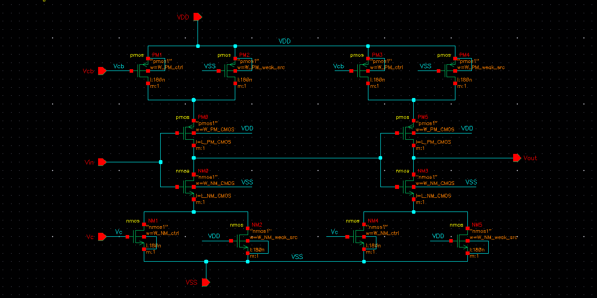
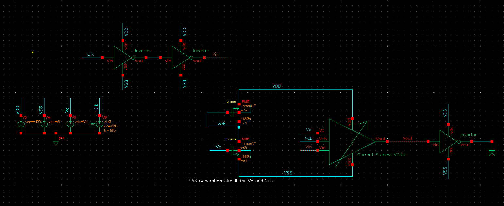
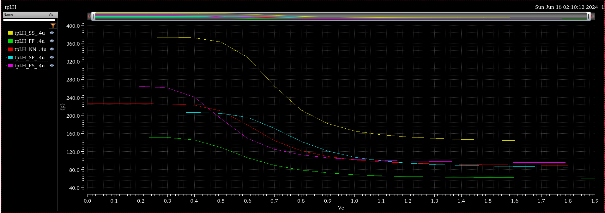

# Design_of_Wide_Range_Tunable_Delay_Line

Variable Delay Lines are circuit elements that introduce a controllable amount of delay to a signal passing through it. This delay can be adjusted based on specific requirements, making it an important element in modern ICs. They have found applications in various domains, such as signal processing and communication systems. A commonly used variable delay element includes a <b>Voltage Controlled Delay Line (VCDL)</b>, where the delay is controlled by an external voltage given to the circuit. This type of delay line is commonly used in delay-locked loops (DLLs), and phase-locked loops (PLLs).

<b>Cadence Virtuoso</b> has been used to simulate all the circuits. Cadence Virtuoso is a Linux-based computer-aided tool used to create and analyze IC designs and layouts. The PDK used was the <b>180nm Generic Process Design Kit (GPDK180)</b>, where the minimum channel length of MOSFETs was 180nm.

### Propagation Delay

The propagation delay of an inverter is the time it takes for an input signal change to result in a corresponding change at the output. It can be divided into two types - 

<ul>
  <li><b>High-to-Low propagation delay</b> ($t_pHL$): The time it takes for the output to transition from high to low after the input transitions from low to high.</li>
  <li><b>Low-to-High propagation delay</b> ($t_pLH$): The time it takes for the output to transition from low to high after the input transitions from high to low.</li>
</ul>

### Current Starved Inverter architecture

A current-starved inverter consists of a standard CMOS inverter with additional transistors that control the current flowing through the inverter. By adjusting the gate voltage of these additional transistors, the delay through the inverter can be controlled.

This architecture tunes the charging and discharging currents of an inverter to achieve variability in delay. To design this delay unit, an NMOS and a PMOS transistor were used in the discharging and charging paths, respectively, to tune the currents, and a weaker, always-on current source was provided in order to ensure the current doesn’t go to zero.

<figure>
  
  <figcaption>Schematic of delay unit composed of 2 current starved inverters cascaded together</figcaption>
</figure>
  
<figure>
  
  <figcaption>Testbench</figcaption>
</figure>
   

The sizes of different transistors were adjusted to control the delay and obtain a reasonable delay range for the delay unit for different process corners.

The sizes of the always-on current source transistors($NM2$ and $PM2$ for 1st inverter and $NM5$ and $PM4$ for 2nd inverter) can be tuned to increase the maximum delay (obtained at $V_c=0$) and hence increase the delay range. It was observed that on reducing the width $W$ of these weak-source transistors in the charging and discharging path, the maximum delay increased. This is due to the fact that the propagation delay $t_p$ is proportional to $\frac{C}{I}$, where $C$ is the capacitance and $I$ is the charging/discharging current, so on reducing width of the transistors, the current $I$ reduces and hence delay $t_p$ increases.

Below is a plot of the $t_pLH$ <b>propagation delay vs</b> $V_c$ <b>control voltage</b> for $W=400nm$ and $L=180nm$ for various process corners

<figure>
  
  <figcaption>
$t_pLH$ vs $V_c$ for 5 process corners
</figcaption>
</figure>
  

In the delay unit shown above, we can see that

$T_pLH$ = $t_pHL_1$ + $t_pLH_2$

$T_pHL$ = $t_pLH_1$ + $t_pHL_2$

where $T_pHL$ and $T_pLH$ are the propagation delays of the delay unit, and $t_pLH$ and $t_pHL$ are the delays of the corresponding individual inverters.

The $t_pLH$ and $t_pHL$ propagation delays for the two individual inverters (which are cascaded together to form a delay unit), as well as the delay unit, were analysed

<figure>
  
  <figcaption>Delay($t_pLH$ and $t_pHL$) of individual inverters and delay unit for $NN$ process corner</figcaption>
</figure>
  
<figure>
  
  <figcaption>Delay($t_pLH$ and $t_pHL$) of individual inverters and delay unit for $SS$ process corner</figcaption>
</figure>

